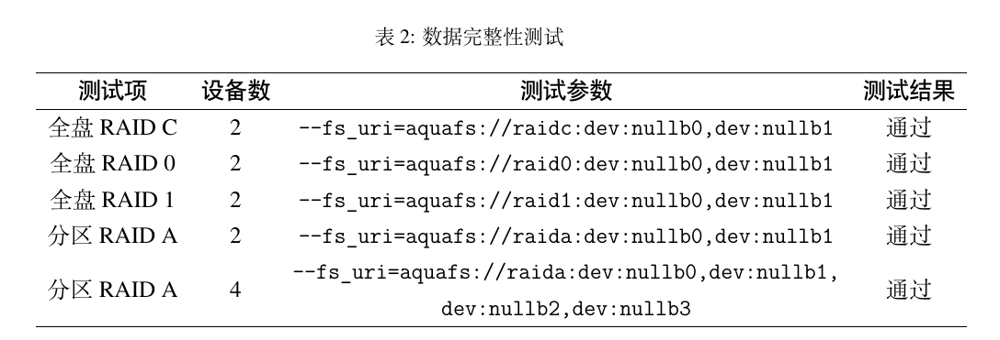
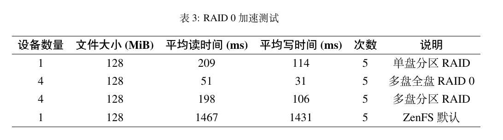
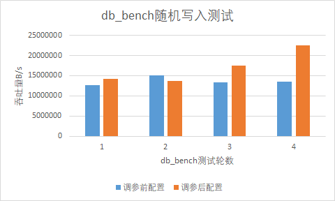

## 队名：RethinkFS

我们队“RethinkFS”来自**哈尔滨工业大学（深圳）**，基本情况如下：

| 赛题     | [proj117-smart-flash-fs](https://github.com/oscomp/proj117-smart-flash-fs) |
| ---------- | ---------------------------------------------------------------------------- |
| 小组成员 | 李羿廷、梁鑫嵘                                                             |
| 指导老师 | 夏文、李诗逸                                                               |

## 文档信息

- 主要技术报告 PDF：[RethinkFS-初赛报告.pdf](RethinkFS-初赛报告.pdf)
- 过程文档位置：[在线浏览](https://rethinkfs.github.io/docs/) / [文档源码](docs/SUMMARY.md)
- 进度相关信息：[在线浏览：进度报告](https://rethinkfs.github.io/docs/%E8%BF%9B%E5%BA%A6%E6%8A%A5%E5%91%8A/index.html)
- 初赛技术报告源码：[TeX 项目](paper/)
- 使用文档：[在线浏览：Get Started](https://rethinkfs.github.io/docs/%E4%BD%BF%E7%94%A8%E6%96%87%E6%A1%A3/GetStarted.html)

## 赛题完成情况

我们在初赛阶段对基于 ZNS 的文件系统 ZenFS 进行改进，拟实现一个更加智能的文件系统 AquaFS。

ZenFS 由于其简单且与硬件 Zoned Storage SSD 紧密结合等特点，实现了零硬件预留空间、零硬件垃圾回收开销等高负载场景下的高性能特性，但是其仅适合 ZNS 设备、需要软件特殊适配等特点也限制了其应用场景灵活性。

AquaFS 是一个以 ZenFS 为原型的适用于 Zoned Storage SSD 的文件系统，将原来的 ZenFS 模块化，扩展其应用场景，添加 RAID 来平衡数据安全和写放大，同时添加调参模块以提高文件系统的智能性和性能。

在未来，我们将继续实现 AquaFS 的更多功能，如用户态 NVME 驱动加速、更完善的数据恢复、多文件系统融合调参等，进一步扩展应用场景并提升其智能化水平。

初赛阶段进度情况如下：

| 改进内容                      | 完成情况       | 说明                                                                                                                                                     |
| ------------------------------- | ---------------- | ---------------------------------------------------------------------------------------------------------------------------------------------------------- |
| 智能调参模块                  | 进度约70%      | ✅ 基于方差的重要参数选择方案<br />✅ 基于高斯回归的调参方案<br />🚧 将对垃圾回收参数进行进一步测试<br />🚧 将对融合文件系统后的更多参数进行调优测试<br /><br /> |
| 基于 Zone 的智能动态分区 RAID | 整体进度约 80% | ✅ 全盘 RAID 模式 RAID0、RAID1、RAID-C<br/>✅ 分区 RAID 模式 Zone 映射和 RAID 逻辑分配<br />✅ 数据完整性检测和恢复                                      |
| 异步 IO 优化                  | 进度约 60%     | ✅ 完成了`io_uring` 异步读写优化<br />🚧 将进一步研究基于 spdk、xnvme 等的用户态 nvme 驱动                                                               |
| 融合通用文件系统              | 进度约 50%     | ✅ 基于 FUSE 和 Rust 完成一个 Ext2 兼容文件系统<br />🚧 将进一步研究与 ZenFS 的结合方式<br />🚧 将进一步研究智能数据请求分类方法                                         |

**测试结果**

1. 在全盘、分区 RAID 情况下进行 RocksDB 数据库读写并且测试通过，RAID 实现的正确性可以得到验证。
2. `io_uring` 异步 IO 单线程读写优化，在不同 RAID 配置下充分利用硬件并行性从而提高整体带宽利用率。
3. 智能调参模块在 RocksDB 随机写入测试中，能够根据系统运行数据调整文件系统参数，从而逐步提高数据吞吐量。

   

## 项目结构

```
   ┌─────────┐ ┌───────┐
   │ RocksDB │ │  App  │
   └────────┬┘ └┬──────┘
    FS/POSIX│   │VFS/FUSE
┌─AquaFS────┼───┼──────────┬──────┐
│           │   │          │Turner│
│     ┌─────┴───┴────────┐ ├──────┴─────┐
│     │   Data Router    │ │Configurator│
│     └──┬──────────────┬┘ └──────┬─────┘
│    SST │              │ Data    │
│ ┌──────┴───┐ inode ┌──┴───────┐ │
│ │ AquaZFS  │◄──────┤  ExtFS   │ │
│ └──┬───────┘       └───┬──────┘ │
│    │RAID         Extent│        │
│    │   ┌───────────────┤Data    │
│ ┌──┼───┼───────────────┼──────┐ │
│ │  │   │Zones Allocator│      │ │
│ ├──▼───▼───────────────▼──────┤ │
│ │       io_uring/xNVME        │ │
│ ├──────────────┬──────────────┤ │
│ │ Seq Zones    │ Conv Zones   │ │
└─┴──────────────┴──────────────┴─┘
```

[详细信息](https://rethinkfs.github.io/docs/%E7%A0%94%E7%A9%B6%E6%96%B9%E5%90%91/%E6%95%B4%E4%BD%93%E6%9E%B6%E6%9E%84.html)

### 文件夹说明

1. `db`：与 RocksDB 数据库相关转换接口
2. `programs`：AquaFS 相关可执行程序，如文件系统创建和检查、备份和还原、单元测试等
3. `src`：
   1. 框架源代码
   2. 提供模块之间的接口调用逻辑以及数据路由逻辑等
4. `aquafs-plugin`：
   1. 基于原 [ZenFS](https://github.com/westerndigitalcorporation/zenfs) 项目继续开发
   2. 作为我们修改后的 [RocksDB](https://github.com/RethinkFS/rocksdb) 的插件存在，便于运行数据库测试
5. `AquaZFS`：
   1. 完全抽离 RocksDB 相关依赖的独立文件系统
   2. 精简修改相关逻辑，便于系统集成
6. `ExtFS`：
   1. 使用 Rust 开发的一个简单 Ext2 rev0.0 兼容文件系统
   2. 集成进 AquaFS，作为普通数据存储后端
   3. 暂时使用 FUSE 接口
7. `docs`：通过 mdbook 构建的在线文档
8. `paper`：通过 TeX 构建的比赛提交文档

上述许多文件夹本应是 git submodules，但是由于赛题提交限制只能提交一个分支的文件，所以复制出这些子项目中的文件并添加到本代码仓库 `main` 分支。如果需要查看有子项目的版本，或者您需要查看子项目的提交记录，可以查看[本仓库的 `submodules` 分支](https://gitlab.eduxiji.net/202318123111358/project1466467-176094/-/tree/submodules?ref_type=heads)，其中子项目主要指向[我们的 Github](https://github.com/orgs/RethinkFS/repositories)。
